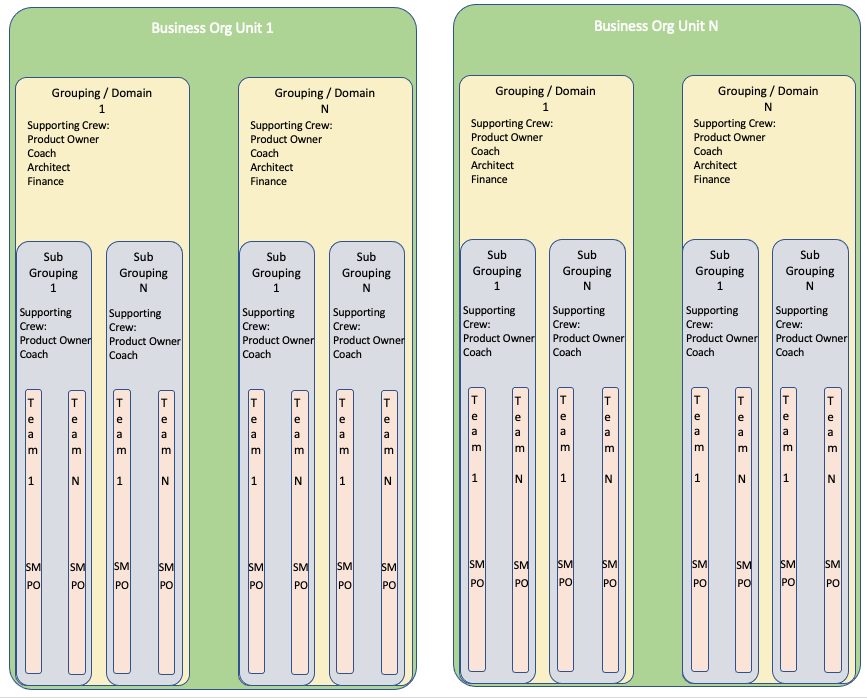

#### Design Delivery structure

- Delivery Structure definition card
  - Mission
  - Strategic Priority
  - Key Activities
  - Not doing, out of scope
- Simplify delivery structure and empower people so that they can server the customer
- have collection of team alignment making it easier to know what work is being done where and by whom
- a Team or a collection of teams that are organisation around a deliverable value proposition outcome.

#### Considerations

- Try and keep structure as shallow as possible
- How to assess individuals to ensure they are in the right talent pools
- People maybe mapped such that there it is a new organisational structures/ change in line management/ role title or descriptions
- Time delays/needed if required for Human Resources consultation or contract re-negotiation time
- Leverage crowd sourcing and individuals to know if they believe they have ended in the wrong talent collective
- Updating Human Resources systems (workday, HRM, PEX, …)

·        Chapter demand or Chapter assignment rate (how many people from chapter working in demand teams; how many working on consistent practices/CoE; how many &quot;on bench&quot;)

·        Chapter geographic view.  Understand working hours and timezone, idea is that teams are in internally in a similar time zone.  Geographic location will also affect demand on office infrastructure and factors of if/how a team could physically work together.

·        Costs: chapter area, chapter

### Establishing consistent practices across Supply - CoEs

·        Supply to think of practices, and how they establish, communicate, and improve them. i.e COE

·        There&#39;s a separate conversation about COEs.  Here supply has to consider investment in internal practices, and the tradeoffs of this investment versus putting people directly in demand/teams.  Particularly for high demand; the investment ROI tradeoff of improved practices/reduced impediments should mean that these COEs are higher value than the alternative work.

·        Also ties into training/upskill.

·        COE = demand structure.  For visibility

## **Boundaries and Hybrids. Between new &amp; existing ways of working**

### Way of working boundaries

Aka agile &amp; not-agile.  Transformed and not-yet-transformed.

·        Interaction between new &amp; existing way of working.  Inevitably work will flow across this boundary.

·        Have to consider how labour supply will work across these two models.  The organization will not stop

·        How does &quot;new&quot; request from &quot;existing/old&quot;

·        How does &quot;existing/old&quot; request from new

·        Tracking &amp; reporting

## **Questions and things to Address Elsewhere or later**

### Maybe another page/chapter for these

   Should Talent pools (Chapters) live

- with in a specific business unit
- whole of company (cross company all talent types)
- as a mix and what would the mix be

·        Supply responsibility.

·        Recruitment (incl working with recruiters, contractors, labour supply orgs, consultancies)

·        career progression, training, upskill and reskill.

·        Consistent practices.

·        Exit from the organization.  Due to drop in demand, and for disciplinary purposes.

- Who leads a chapter; and whether it is a full time job or if there&#39;s an expectation that a chapter lead will be &quot;on the tools&quot; also doing work.
- How these overarching types fit inside the existing organisation, particularly early on in a transformation.  For example, the overarching talent type of full stack engineers could fit under an Engineering and Technology business unit, and marketing overarching talent types could fit under a Sales and Support business unit.

        Frequent challenge is assessing skills.  Similar role could do very well in one team, and very poorly in another – where demand is otherwise identical.  Initial reaction is to rank and rate skill level, but challenge is then how to measure/rate.  By education? By experience/context?   Importance of chapter lead role, and comms between chapter lead and product owner to discover the person-role-fit

·        Process for building/changing teams.  Separate section

·        Funding

·        Artefacts

·        Understanding of roles/skills in the organization.

·        What supply looks like.  Mapping from HRMS to Supply, where not 1:1

·        Labour cost; either to the individual level (high precision, also high PII risk) or a useful aggregate (chapter area average, chapter average, chapter average x some other parameter like labour supply company|band|country)

·        Costs: chapter area, chapter

Supply has to think of forward demand / forecast.

·        How forecasting is collected, and at what level (specific individuals, or just numbers of people with a given skill), to what time horizon (month, quarter, year).  Idea is to build a view of labour supply at a long enough timeframe to act

·        Act, by recruitment / contract / labour supply.  Build runway for increasing in-demand skills.  Recruiting roles will take at least a month, timeframes of 3-6 months are common, more for highly specialized roles.

·        Act, by upskill/re-train existing staff from supply/chapters with lower demand (where demand \&lt; supply).  Advantage of taking people that are already in the organization, have its context, and know its systems of work.  Consider: individual willingness to re-train, and the time/money investment and checkpoints along the way.

·        Together, the above creates tension and a damping/stabilizing force to idea of pivoting too often.  The value of the forecast

### Establishing consistent practices across Supply - CoEs

·        Supply to think of practices, and how they establish, communicate, and improve them. i.e COE

·        There&#39;s a separate conversation about COEs.  Here supply has to consider investment in internal practices, and the tradeoffs of this investment versus putting people directly in demand/teams.  Particularly for high demand; the investment ROI tradeoff of improved practices/reduced impediments should mean that these COEs are higher value than the alternative work.

·        Also ties into training/upskill.

·        COE = demand structure.  For visibility

###  Hybrids

·        Cases where one structure both Supplies and Demands labour.

·        Usually the traditional/not-yet transformed part of the org.  Because their structure and processes hasn&#39;t yet shifted to full supply/demand paradigm; but they still need to get work done

·        They&#39;ll request people from Supply; and Demand areas will request from them.

·        Picture and process of incremental change.  No changing the whole org at once, yet provides early exposure

Usually the traditional/not-yet transformed part of the org.  Because their structure and processes hasn&#39;t yet shifted to full supply/demand paradigm; but they still need to get work done.

As a result these teams (or projects!) are likely to be both

- supplying individuals to other parts of the organisation so they can complete their work, and
- requesting demand from other parts of the organisation so the hybrid/project can complete its work

### Dont feel that these live in the supply chain side.

- creates excessive handoffs of work on customer value streams.  Eg: product development -\&gt; finance -\&gt; product development -\&gt; engineering -\&gt; sales -\&gt; support.  In transforming our organisation, we design design our labour supply to  group similar job roles and skills together into talent pools.

·        Factors to consider: size, guidance chapter members will require on the job / not handled by demand side (product owner), time demands for the team building &amp; adjustment process (launch, annual planning, quarterly planning)

### Process of matching Supply to Demand +  resolving contention

·        Demand will put requests for roles in to Supply.  Eg a team wants 2x software engineers, 1x risk expert, and 1x product owner.   ideally at the chapter level else at chapter area.  What will help this process:

·        Key attributes. Eg experience with specific products, platforms.  Knowledge of given processes, software programming languages.  Certifications or education (external, or internal).  Location. Planned leave.